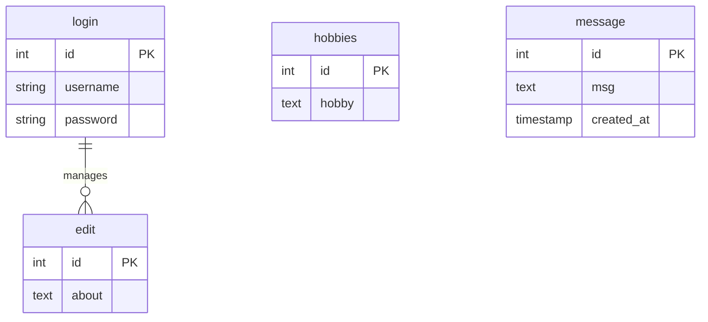
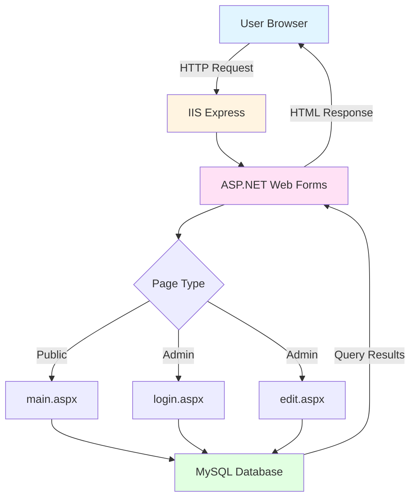
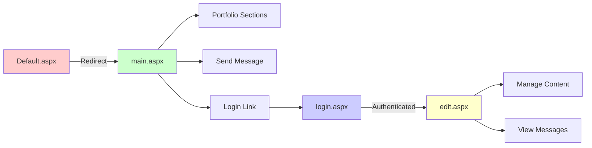
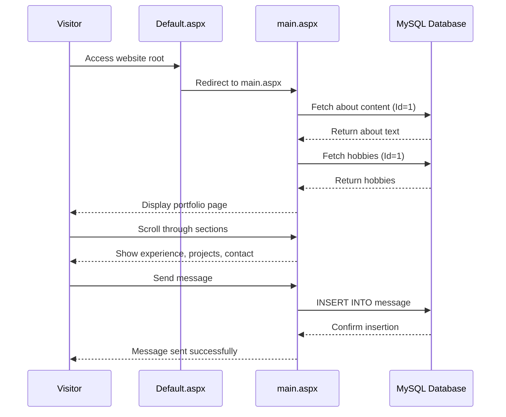
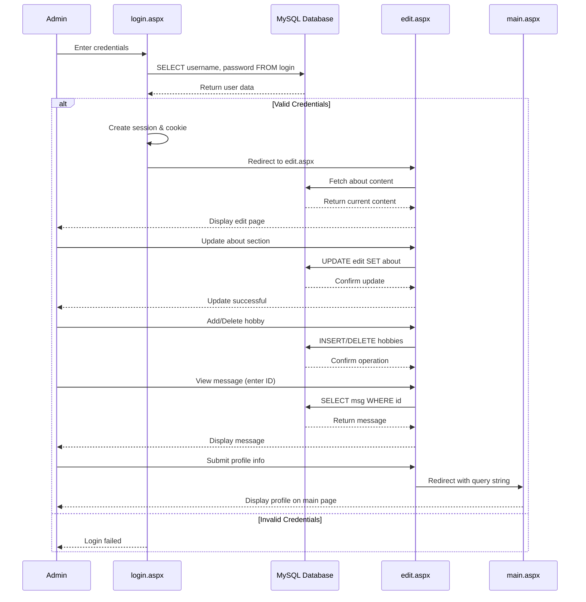
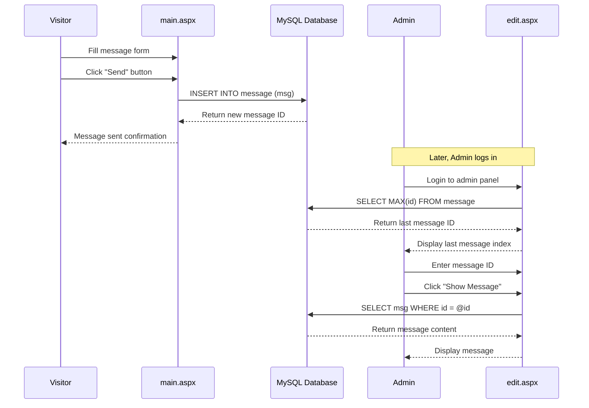

portfolio Website

A modern, responsive portfolio website built with ASP.NET Web Forms that showcases personal information, projects, experience, and allows visitors to send messages. The website includes an admin panel for content management.


📋 Table of Contents

- [Overview](#-overview)
- [Features](#-features)
- [Technology Stack](#-technology-stack)
- [Project Structure](#-project-structure)
- [Installation](#-installation)
- [Database Setup](#-database-setup)
- [Architecture](#-architecture)
- [User Flows](#-user-flows)
- [Usage](#-usage)
- [Screenshots](#-screenshots)
- [Contributing](#-contributing)
- [License](#-license)

🎯 Overview

This is a full-stack portfolio website that allows users to:
- View a professional portfolio with sections for About, Experience, Hobbies, Projects, and Contact
- Send messages to the portfolio owner
- Admin login to manage portfolio content dynamically
- Edit about section and hobbies through an admin panel
- View and manage visitor messages

✨ Features

### Public Features
- **Responsive Design**: Works seamlessly on desktop, tablet, and mobile devices
- **Portfolio Sections**:
  - Profile section with animated text
  - About section with experience and education
  - Experience section showcasing technical skills
  - Hobbies section
  - Projects showcase with GitHub links
  - Contact section with email and LinkedIn
- **Message System**: Visitors can send messages that are stored in the database
- **Social Links**: Direct links to LinkedIn and GitHub profiles
- **Resume Download**: Download CV/Resume functionality

Admin Features
- **Secure Login**: Cookie-based authentication with session management
- **Content Management**:
  - Edit "About" section content
  - Manage hobbies section
  - View and retrieve visitor messages by ID
  - Delete hobbies entries
- **Profile Information**: Submit profile information (email, occupation, gender) that displays on the main page

🛠 Technology Stack

### Frontend
- **HTML5/CSS3**: Modern web standards
- **JavaScript**: Interactive features and animations
- **Responsive Design**: Mobile-first approach with media queries

### Backend
- **ASP.NET Web Forms**: Server-side framework
- **C#**: Programming language (.NET Framework 4.7.2)
- **MySQL**: Database management system

### Libraries & Tools
- **MySql.Data**: MySQL connector for .NET
- **BouncyCastle.Cryptography**: Cryptographic library
- **Google.Protobuf**: Protocol buffers support

📁 Project Structure

```
port_folio-master/
│
├── assets/                 # Images, PDFs, and media files
│   ├── profile pictures
│   ├── project images
│   └── icons
│
├── bin/                    # Compiled DLLs and dependencies
│
├── class/                  # Custom classes
│   └── Profile.cs         # Profile data model
│
├── cssjs/                  # Stylesheets and JavaScript
│   ├── style.css          # Main stylesheet
│   ├── login_style.css    # Login page styles
│   ├── mediaqueries.css   # Responsive design
│   └── script.js          # JavaScript functionality
│
├── Default.aspx           # Entry point (redirects to main.aspx)
├── main.aspx              # Main portfolio page
├── login.aspx             # Admin login page
├── edit.aspx              # Admin content management page
│
├── Web.config             # Application configuration
├── Port_folio.csproj      # Project file
└── packages.config        # NuGet packages
```

🚀 Installation

### Prerequisites

- **Visual Studio 2019/2022** or later
- **.NET Framework 4.7.2** or higher
- **MySQL Server 8.0** or later
- **IIS Express** (included with Visual Studio)

### Step 1: Clone the Repository

```bash
git clone https://github.com/joker2353/port_folio-master.git
cd port_folio-master
```

### Step 2: Restore NuGet Packages

Open the project in Visual Studio and restore NuGet packages:

```bash
# In Visual Studio Package Manager Console
Update-Package -reinstall
```

Or right-click on the solution → **Restore NuGet Packages**

### Step 3: Configure Database Connection

Update the connection string in the following files:
- `main.aspx.cs`
- `login.aspx.cs`
- `edit.aspx.cs`

Change the connection string from:
```csharp
string connectionString = "Server=localhost;Database=portfolio;Uid=root;Pwd=;";
```

To match your MySQL configuration:
```csharp
string connectionString = "Server=YOUR_SERVER;Database=portfolio;Uid=YOUR_USERNAME;Pwd=YOUR_PASSWORD;";
```

### Step 4: Build the Project

1. Open `Port_folio.csproj` in Visual Studio
2. Build the solution: **Build → Build Solution** (Ctrl+Shift+B)
3. Run the project: **Debug → Start Debugging** (F5)

## 🗄 Database Setup

### Create Database

```sql
CREATE DATABASE portfolio;
USE portfolio;
```

### Create Tables

```sql
-- Login table for admin authentication
CREATE TABLE login (
    id INT AUTO_INCREMENT PRIMARY KEY,
    username VARCHAR(50) NOT NULL,
    password VARCHAR(50) NOT NULL
);

-- Insert default admin credentials (change password in production!)
INSERT INTO login (username, password) VALUES ('admin', 'your_password');

-- Edit table for about section content
CREATE TABLE edit (
    id INT PRIMARY KEY,
    about TEXT
);

-- Insert default about content
INSERT INTO edit (id, about) VALUES (1, 'Your default about text here...');

-- Hobbies table
CREATE TABLE hobbies (
    id INT PRIMARY KEY,
    hobby TEXT
);

-- Messages table for visitor messages
CREATE TABLE message (
    id INT AUTO_INCREMENT PRIMARY KEY,
    msg TEXT NOT NULL,
    created_at TIMESTAMP DEFAULT CURRENT_TIMESTAMP
);
```

### Database Schema Diagram



## 🏗 Architecture

### System Architecture



### Application Flow



## 🔄 User Flows

### Visitor Flow - Viewing Portfolio



### Admin Flow - Login and Content Management



### Message Flow - Visitor to Admin



💻 Usage

### For Visitors

1. **Access the Website**: Navigate to the root URL (e.g., `https://localhost:44353/`)
2. **Browse Portfolio**: Scroll through different sections:
   - Profile and introduction
   - About me
   - Experience and skills
   - Hobbies
   - Projects
   - Contact information
3. **Send Message**: 
   - Scroll to the "Contact Me" section
   - Enter your message in the text box
   - Click "Send" button
4. **Download Resume**: Click the "Download CV" button to download the resume PDF
5. **Social Links**: Click on LinkedIn or GitHub icons to visit social profiles

### For Administrators

1. **Login**:
   - Click "Log In" button at the bottom of the main page
   - Enter username and password
   - Click "LOGIN" button
   - Credentials are saved in cookies for 7 days

2. **Edit About Section**:
   - After login, you'll be redirected to the edit page
   - Modify the text in the "About" textbox
   - Click "Update" button
   - Changes will reflect on the main page

3. **Manage Hobbies**:
   - Enter hobby information in the "Hobbies" textbox
   - Click "Insert" to add new hobbies
   - Click "Delete" to remove hobbies (deletes entry with Id=1)

4. **View Messages**:
   - The page displays the index of the last inserted message
   - Enter a message ID in the textbox
   - Click "Show Message" to view the message content

5. **Submit Profile Information**:
   - Enter email, select occupation, and gender
   - Click "Submit" button
   - Information will be displayed on the main page via query string

6. **Logout**:
   - Click "Log Out" button to end the session

## 📸 Screenshots

### Main Portfolio Page
```
┌─────────────────────────────────────────┐
│  Peyal.    About  Experience  Projects  │
├─────────────────────────────────────────┤
│                                         │
│     [Profile Picture]                   │
│     Hello, I'm                          │
│     Peyal Saha                          │
│     I'm a [Animated Text]               │
│     [Download CV] [Contact Info]        │
│     [LinkedIn] [GitHub]                 │
│                                         │
├─────────────────────────────────────────┤
│  About Me                               │
│  [About Picture]  Experience & Education│
│                  [About Text from DB]   │
├─────────────────────────────────────────┤
│  Experience                             │
│  Frontend: HTML, CSS, JS, React...      │
│  Backend: MySQL, Node.js, Express...    │
├─────────────────────────────────────────┤
│  Projects                               │
│  [Project 1] [Project 2] [Project 3]    │
│  [Github] [Live Demo]                   │
├─────────────────────────────────────────┤
│  Contact Me                             │
│  Email: peyalsaha455@gmail.com          │
│  [Message Box] [Send]                   │
└─────────────────────────────────────────┘
```

### Admin Login Page
```
┌─────────────────────────┐
│      Login              │
├─────────────────────────┤
│  Username: [________]   │
│  Password: [________]   │
│                         │
│      [LOGIN]            │
└─────────────────────────┘
```

### Admin Edit Page
```
┌─────────────────────────────────────────┐
│           Edit Page                     │
├─────────────────────────────────────────┤
│  About:                                 │
│  [Multi-line textbox]                   │
│  [Update]                               │
│                                         │
│  Email: [________]                      │
│  Occupation: [Dropdown ▼]               │
│  Gender: ( ) Male ( ) Female ( ) Other  │
│  [Submit]                               │
│                                         │
│  Hobbies:                               │
│  [Multi-line textbox]                   │
│  [Insert] [Delete]                      │
│                                         │
│  Messages                               │
│  Last Index: [ID]                       │
│  [Message display area]                 │
│  ID: [____] [Show Message]              │
│                                         │
│         [Log Out]                       │
└─────────────────────────────────────────┘
```

🔒 Security Considerations

⚠️ **Important Security Notes**:

1. **Password Storage**: Currently, passwords are stored in plain text. For production, implement password hashing (e.g., bcrypt, PBKDF2).

2. **SQL Injection**: The code uses parameterized queries which helps prevent SQL injection, but always validate user inputs.

3. **Session Management**: Implement proper session timeout and secure session handling.

4. **Connection String**: Never commit connection strings with credentials to version control. Use `Web.config` transformations or environment variables.

5. **HTTPS**: Always use HTTPS in production to encrypt data in transit.

6. **Input Validation**: Add server-side validation for all user inputs.

## 🧪 Testing

### Manual Testing Checklist

- [ ] Portfolio page loads correctly
- [ ] All sections display properly
- [ ] Responsive design works on mobile/tablet
- [ ] Message sending functionality
- [ ] Admin login with valid credentials
- [ ] Admin login with invalid credentials
- [ ] Edit about section
- [ ] Add/delete hobbies
- [ ] View messages by ID
- [ ] Logout functionality
- [ ] Resume download
- [ ] Social media links

🤝 Contributing

Contributions are welcome! Please follow these steps:

1. Fork the repository
2. Create a feature branch (`git checkout -b feature/AmazingFeature`)
3. Commit your changes (`git commit -m 'Add some AmazingFeature'`)
4. Push to the branch (`git push origin feature/AmazingFeature`)
5. Open a Pull Request

📝 License

This project is licensed under the MIT License - see the LICENSE file for details.

👤 Author

**Peyal Saha**

- LinkedIn: [peyal-saha-4554b222a](https://www.linkedin.com/in/peyal-saha-4554b222a/)
- GitHub: [joker2353](https://github.com/joker2353)
- Email: peyalsaha455@gmail.com

🙏 Acknowledgments

- Thanks to all contributors who have helped improve this project
- Icons and images used in the project
- ASP.NET community for excellent documentation

📞 Support

If you have any questions or need help, please:
- Open an issue on GitHub
- Contact via email: peyalsaha455@gmail.com
- Connect on LinkedIn

---

⭐ If you found this project helpful, please give it a star on GitHub!

